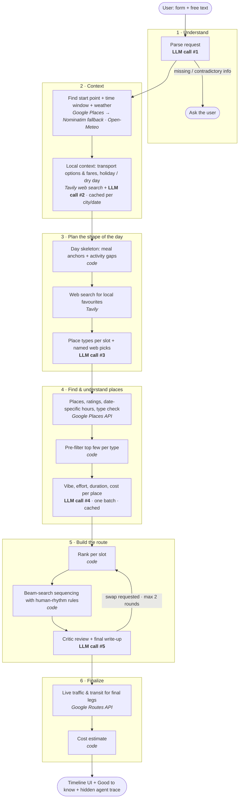

# Saturday Planner

An AI agent that turns *"2 of us from Indiranagar, Bangalore — we like cafes, lakes and museums"* into a realistic,
followable Saturday: real places, the right order, meals at meal times, weather-aware choices, and the cheapest
sensible way to get from one stop to the next — with a one-line reason for every stop.

**Live app:** https://saturday-planner.onrender.com/

---

## Architecture

The LLM does judgment; code does math. Each step uses its own tool, and there's no single giant prompt.



### Where tools and the LLM are used
| Step | External tool | LLM (Gemini) | Cached |
|---|---|---|---|
| Parse request | — | 1 call | — |
| Start point, weather, sunset | Google Places (Nominatim fallback), Open-Meteo | — | start point |
| Transport + holiday info | Tavily (≤2 searches) | 1 call | per city / per date |
| Local favourites | Tavily (≤5 searches) | — | yes |
| Place types + web picks | — | 1 call | — |
| Places | Google Places Text Search (1 per type/interest + missing picks) | — | yes |
| Place understanding | — | 1 batched call | per place |
| Ranking, sequencing, costs | — (code) | — | — |
| Critic + explanation | — | 1 call (+1 per revision) | — |
| Final travel times | Google Routes (drive + transit per leg) | — | yes |

**Typical cold run:** ~6 LLM calls and ~25 HTTP calls, about 35 seconds. Repeat plans for the same city or date need fewer.
Every tool has a fallback: if a service fails, the plan still completes with less detail.

---

## Run locally

**Prerequisites:** Python 3.12 ([uv](https://docs.astral.sh/uv/) recommended), plus API keys for
Gemini (required), Google Maps with *Places API (New)* and *Routes API* enabled (recommended), and Tavily (recommended).

```bash
git clone <your-repo-url> && cd planning_agent
cp .env.example .env              # fill in GEMINI_API_KEY, GOOGLE_MAPS_API_KEY, TAVILY_API_KEY

# option A — uv
uv venv --python 3.12
uv pip install -r requirements.txt
uv run uvicorn app.main:app --reload --port 8000

# option B — Docker
docker build -t saturday-planner .
docker run -p 8000:8000 --env-file .env saturday-planner
```

Open http://localhost:8000. Health check: http://localhost:8000/healthz

### Configuration (`.env`)
| Variable | Default | Purpose |
|---|---|---|
| `GEMINI_API_KEY` / `GEMINI_MODEL` | — / `gemini-3.5-flash-lite` | LLM |
| `GOOGLE_MAPS_API_KEY` | — | Places + Routes; without it, OpenStreetMap and estimated travel times are used |
| `TAVILY_API_KEY` | — | Web search for local favourites, transport and holiday info |
| `LOG_FORMAT` | `text` | `json` for production (one JSON line per event with `run_id`) |
| `PLAN_RATE_LIMIT` | `6/600` | Plans per IP per window (seconds) |
| `DAILY_PLAN_LIMIT` | `300` | Protects paid API quotas |
| `MAX_CONCURRENT_PLANS` | `4` | Concurrency cap |

---

## Project layout
```
app/
  main.py          API, usage caps, access logs, health check
  orchestrator.py  pipeline, per-run state, stage events, relaxed retry
  parser.py        request → profile, clarifying questions, contradiction checks
  context.py       geocoding, time window, weather
  localinfo.py     transport profile + holiday check (one LLM call)
  genres.py        place taxonomy, day skeleton, genre planning + web picks
  places.py        web search, Google Places, type filtering, enrichment
  scorer.py        per-slot ranking
  sequencer.py     beam-search route building + human-rhythm rules
  travel.py        mode choice (walk/auto/cab/metro/bus) + live routing
  cost.py          cost ranges
  critic.py        critic + explanation
  util.py          LLM client, HTTP client, cache, logging, per-run state
static/index.html  single-page UI
Dockerfile, render.yaml   deployment
```

## Deploy
Push to GitHub, then on [Render](https://render.com) choose **New → Blueprint** and pick the repo (`render.yaml` is included).
Add the three API keys when prompted. The app is served from a single URL. See DESIGN_DECISIONS.md → Deployment for the trade-offs.
